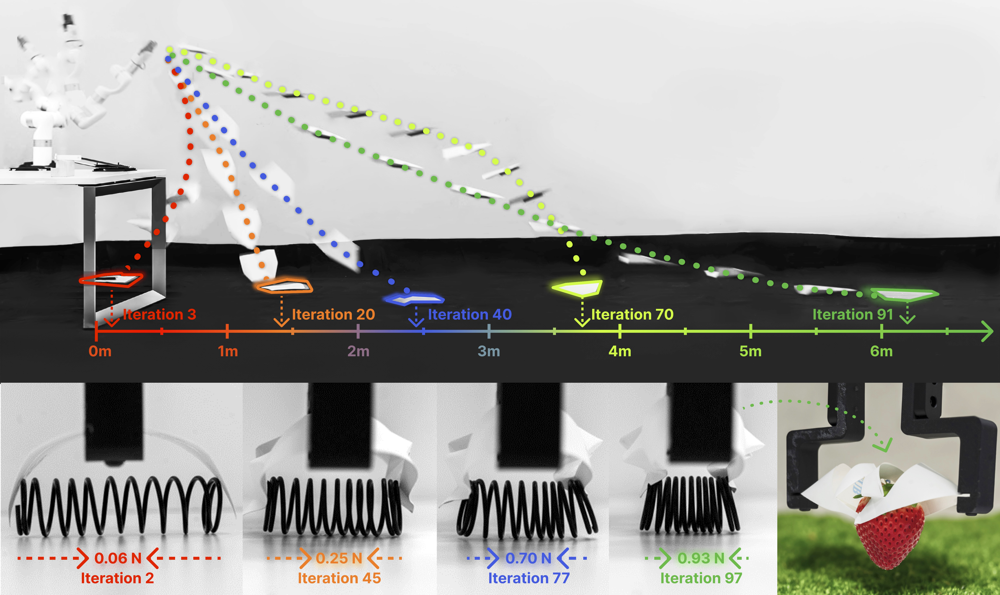

# PaperBot: Learning to Design Real-World Tools Using Paper
### Arxiv 2024
### [Project Page](https://paperbot.cs.columbia.edu/)  | [Paper](https://paperbot.cs.columbia.edu/assets/paperbot.pdf)

[PaperBot: Learning to Design Real-World Tools Using Paper](https://paperbot.cs.columbia.edu/)  
 [Ruoshi Liu](https://ruoshiliu.github.io/)1, [Junbang Liang](https://www.linkedin.com/in/junbangliang/)1,[Sruthi Sudhakar](https://sruthisudhakar.github.io/)1, [Huy Ha](https://www.cs.columbia.edu/~huy/)1,2, [Cheng Chi](https://cheng-chi.github.io/)1,2, [Shuran Song](https://shurans.github.io/)1,2, [Carl Vondrick](https://www.cs.columbia.edu/~vondrick/)1  
 1Columbia University, 2Stanford University

  

